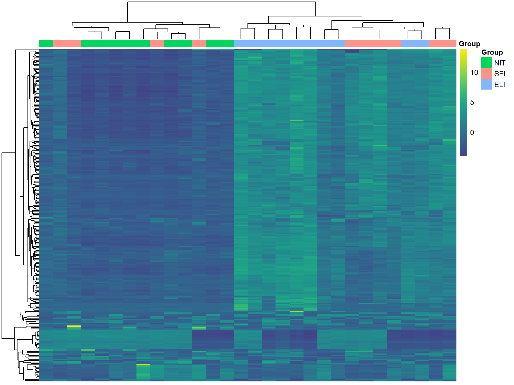
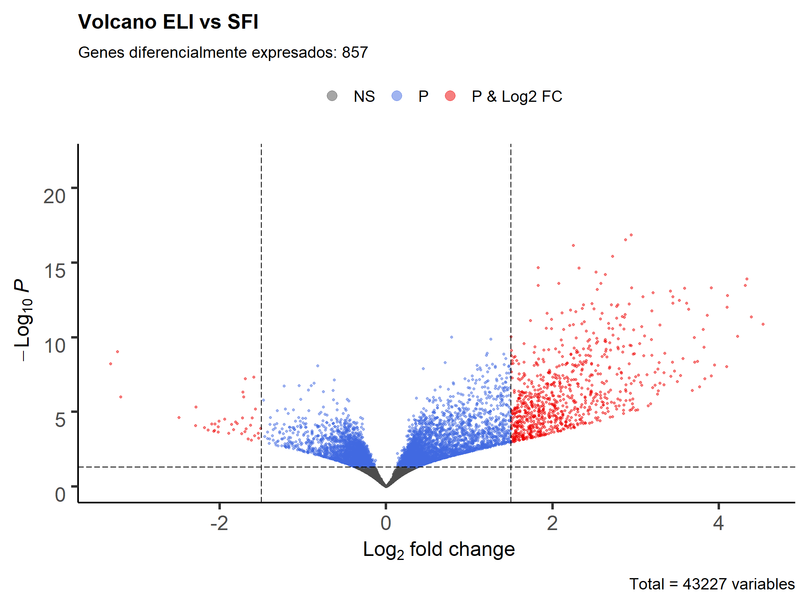
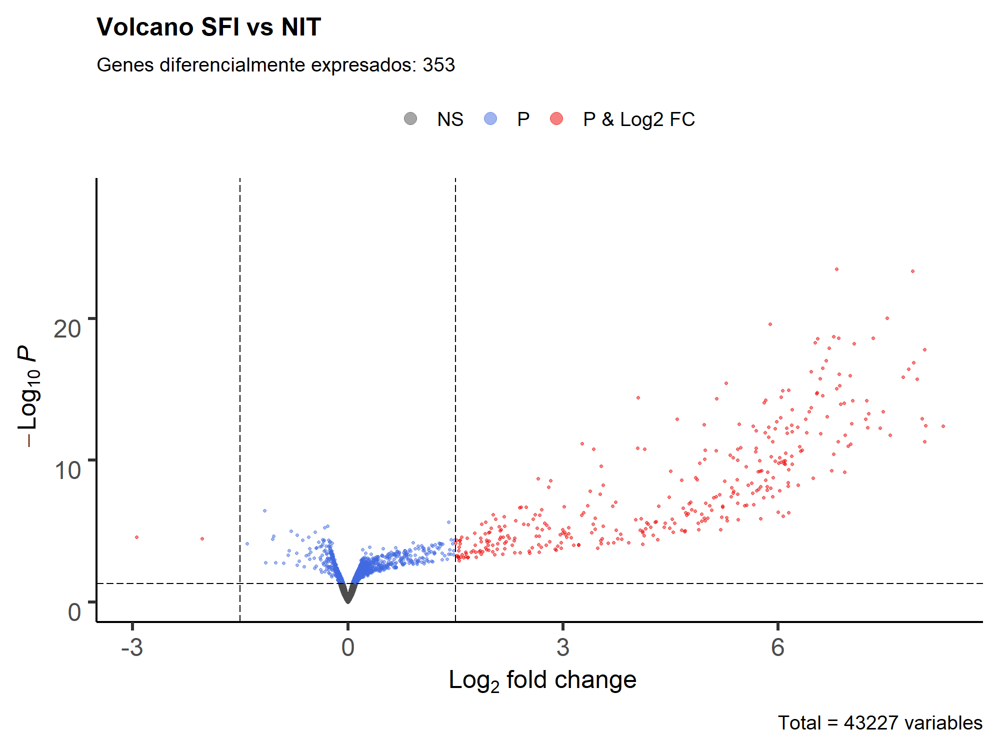

\newpage

# Resumen

Se han analizado 30 muestras de tiroides con distintos grados de infiltración: sin infiltración (NIT), con infiltración pequeña (SFI) y con gran infiltración (ELI), se ha comparado la expresión diferencial de estás tres condiciones por parejas, los resultados muestran una sobreexpresión de genes involucrados en la activación del sistema inmune en los tejidos con mayor grado de infiltración, lo que sugiere una posible infección en el paciente o una desregulación génica en estos tejidos.

El repositorio con todos los análisis realizados se puede consultar en el siguiente enlace
https://github.com/RashBabiker/PEC2.git

# Objetivos

En este estudio se persiguen 2 objetivos:

* Analizar la expresión génica de los tejidos de tiroides con distintos grados de infiltración.

* Localizar genes, rutas metabólicas y procesos diferencialmente expresados

El enunciado de la PEC indica que no se espera de este informe una interpretación biológica de los resultados.

\newpage 

# Materiales y Métodos

A continuación, se explican los pasos seguidos para procesar y analizar las muestras proporcionadas, también se indica el nombre de los archivos de Rmarkdown del repositorio donde se puede acceder el código usado para la realización de cada tarea con una explicación mucho más detallada:

## 1. Muestreo y normalización por DESeq2 (código en "01 Muestreo y preprocesado.Rmd"):

Selección aleatoria de 10 muestras de cada grupo (ELI, SFI y NIT). Estas muestras se normalizan con DESeq, los datos resultantes se usan para el análisis de expresión diferencial. Para análisis descriptivos como heatmaps y PCAs se recomienda que los datos sean homocedásticos, por ello se transforman los datos normalizados con DESeq rlog.

## 2. Analisis descriptivo general y control de calidad (código en "02 analisis descriptivo.Rmd")

Breve descripción visual de las muestras, para cuantificar la similitud entre replicas replicas y las diferencias entre grupos. 

## 3. Análisis de expresión diferencial y de significación biológica (códigos en "03 ELI vs NIT.Rmd", "04 SFI vs NIT.Rmd" y "05 ELI vs SFI.Rmd"):

A partir de los datos normalizados con DESeq2 se hacen comparaciones por parejas de los tejidos con distintos niveles de infiltración, en estas comparaciones se pone en el numerador las muestras con mayor grado de infiltración (ELI>SFI>NIT), de forma que los genes sobreexpresados serán aquellos que se expresen más en la muestra con mayor infiltración, en esta comparación.

### 3.1 Preparación de los datos

Según Conesa y colaboradores [@Conesa2016] para 10 réplicas por grupos y con un nivel de significación del 0.05, el fold change de 1,25 tiene una potencia (probabilidad de detectar expresión diferencial) del 44%, mientras que con 1.5 FC la potencia sube al 91%, por lo que usamos FC=1.5. El coeficiente de correlación elegido es 0.05 porque es el valor estándar y no se aprecia motivo para cambiarlo.

Encoger (Shrink) el fold change de los genes con pocas cuentas reduce el ruido, es util en rankings y visualización, se probaron distintos métodos para encoger, siendo el más eficaz el método ashr [@10.1093/biostatistics/kxw041]

### 3.2. Anotación y Análisis de sobrerrepresentación (ORA)

A partir del código de ENSEMBL de los genes diferencialmente expresados en las distintas comparaciones, se mapea información de otras bases de datos, de especial interés son EntrezID, GO y KEGG. El análisis de sobrerrepresentación consiste en un resumen de las rutas metabólicas de KEGG y de las categorías de GO más representadas de un conjunto de grupos. En este análisis se ha elegido mostrar solo los genes sobreexpresados en la condición con mayor filtración porque resultan de mayor interés, los procesos sobrerrepresentados en los tejidos con menor infiltración se pueden observar en la carpeta resultados del repositorio de github.

# Resultados y discusión

La matriz de distancias y el PCA muestran claras diferencias en los patrones de expresión entre ELI (infiltraciones extensivas) y NIT (sin infiltraciones), pero los SFI (infiltraciones pequeñas) aparecen cerca de ambos como un punto intermedio, tiene sentido porque fenotípicamente SFI está entre ELI y NIT. 

```{r echo=F, fig.align="center", out.height="550px"}
knitr::include_graphics("resultados/Figuras adaptadas illustrator/PCA y matriz.pdf")
```

\newpage

El siguiente heatmap de los genes más variables muestra una diferenciación clara entre NIT y ELI en el clustering como en la expresión de estos genes. Si las infiltraciones no son evidentes a nivel fenotípico, el análisis de expresión de estos genes podría usarse como método de diagnóstico, o como método complementario para distinguir entre tipos de infiltración.

También se ven diferencia entre el grupo central de ELI, donde estos genes se expresan más que tejidos SFI y otros ELI, lo que sugiere que quizás se pudiera hacer una nueva clasificación, seguramente en ese grupo central de ELI la infiltración es mayor aún. 

```{r echo=F, fig.align="center", out.width="450px"}

```

A continuación se pasa a analizar la expresión diferencial por parejas.

\newpage

## ELI vs NIT

```{r echo=F, warning=F}
elinit <- read.csv("resultados/ELI vs NIT/DGE_sig.csv")
elinit <- elinit[order(elinit$padj),c(1,3,7,8,9,10)]
elinit[is.na(elinit)] <- ""
```

Como era de esperar, en esta comparación es donde más genes diferencialmente expresados se observan (`r nrow(elinit)`, los marcados en rojo en el volcano plot). La mayoría de los genes sobreexpresados en los tejidos con mayor infiltración están relacionados con activación del sistema inmunológico, lo que sugiere una posible infección o una desregulación genética.

```{r echo=F, fig.align="center", out.height="700px", out.width="450px"}
knitr::include_graphics("resultados/ELI vs NIT/imagenes/Volcano.png")
```

Genes más diferencialmente expresados, el archivo completo está en la carpeta resultados de github:

```{r echo=F, warning=F}
library(knitr)
kable(head(elinit,14))
```

```{r echo=F, fig.align="center", out.height="700px", out.width="450px"}
knitr::include_graphics("resultados/Figuras adaptadas illustrator/upregulated GO ELI vs NIT.pdf")
knitr::include_graphics("resultados/Figuras adaptadas illustrator/upregulated KEGG ELI vs NIT.pdf")
```

\newpage

## ELI vs SFI

```{r echo=F, warning=F}
elisfi <- read.csv("resultados/ELI vs SFI/DGE_sig.csv")
elisfi <- elisfi[order(elisfi$padj),c(1,3,7,8,9,10)]
elisfi[is.na(elisfi)] <- ""
```

Hay una menor cantidad de genes expresados diferencialmente entre las muestras ELI y SFI (`r nrow(elisfi)`), pero esta diferencia es bastante superior a la observada al comparar SFI y NIT, lo que indica que las muestras SFI son más similares a las NIT que a las ELI, como también se podía observar en el PCA. Las rutas con mayor sobreexpresión están relacionadas con el sistema inmunológico, al igual que en la comparación anterior.

```{r echo=F, fig.align="center", out.width="450px"}

```

Genes más diferencialmente expresados:

```{r echo=F, warning=F}
library(knitr)
kable(head(elisfi,14))
```

```{r echo=F, fig.align="center", out.height="700px", out.width="450px"}
knitr::include_graphics("resultados/Figuras adaptadas illustrator/upregulated GO ELI vs SFI.pdf")
knitr::include_graphics("resultados/Figuras adaptadas illustrator/upregulated KEGG ELI vs SFI.pdf")
```

\newpage

## SFI vs NIT

```{r echo=F, warning=F}
sfinit <- read.csv("resultados/SFI vs NIT/DGE_sig.csv")
sfinit <- sfinit[order(sfinit$padj),c(1,3,7,8,9,10)]
sfinit[is.na(sfinit)] <- ""
```

Estas son las muestras más similares entre sí, con expresión diferencial solo en `r nrow(sfinit)` genes, al igual que en las otras comparaciones, las rutas metabólicas más afectadas por la infiltración están relacionadas con la activación del sistema inmunológico.

```{r echo=F, fig.align="center", out.width="450px"}

```

```{r echo=F, warning=F}
library(knitr)
kable(head(sfinit,14))
```

```{r echo=F, fig.align="center", out.height="700px", out.width="450px"}
knitr::include_graphics("resultados/Figuras adaptadas illustrator/upregulated GO SFI vs NIT.pdf")
knitr::include_graphics("resultados/Figuras adaptadas illustrator/upregulated KEGG SFI vs NIT.pdf")
```

\newpage

# Bibliografía
